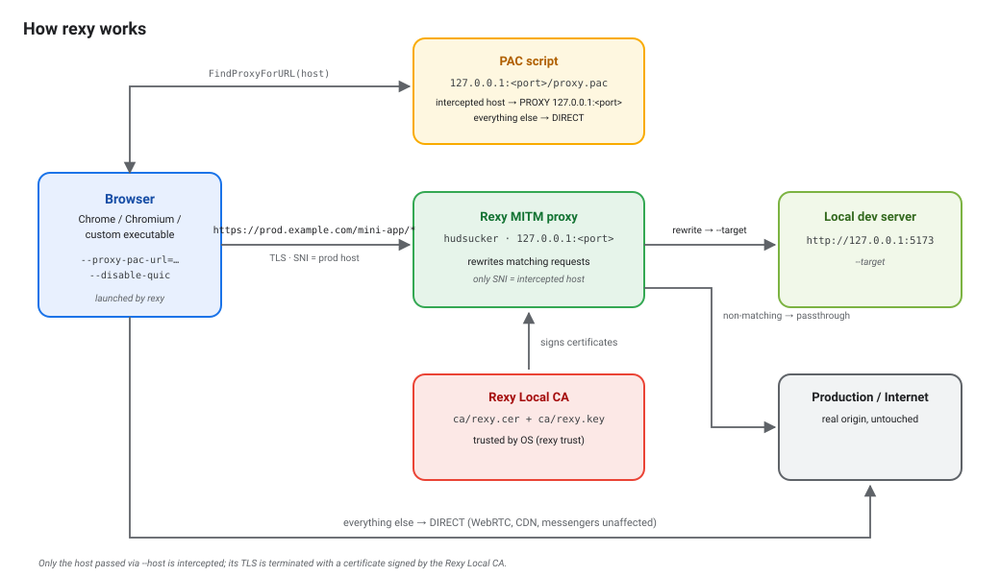

# rexy

`rexy` launches a browser through a local man-in-the-middle (MITM) proxy. The proxy
intercepts traffic to one live site (e.g. `example.com`) and serves requests under a
chosen path prefix from your local dev server — everything else reaches the live site
untouched. No `/etc/hosts`, no DNS tricks, no self-signed certificates on your dev
server.

You give `rexy` three things: the domain of a live site, a path prefix, and your dev
server URL. It starts the local proxy, generates a PAC file that routes only that domain
through it, and launches Chrome (or Chromium, or any browser executable). Then you just
browse the site as usual — the matching pages are transparently served from your local
build.



## How it works

1. `./generate_ca.sh` generates a local certificate authority (one-time setup) in
   `ca/` — `rexy.cer` (the certificate) and `rexy.key` (its private key).
2. `rexy trust` installs that CA into your OS trust store, so the browser accepts the
   certificates the proxy issues on the fly.
3. On `rexy run`, the tool:
   - starts a [hudsucker](https://crates.io/crates/hudsucker) MITM proxy on
     `127.0.0.1` (a free port by default),
   - serves a PAC script that routes **only** the intercepted host (and its
     subdomains) through the proxy — everything else goes `DIRECT`, so messengers,
     WebRTC/STUN, long-poll and CDNs are unaffected,
   - launches the browser with `--proxy-pac-url=...` and `--disable-quic`,
   - rewrites matching requests: `https://<host><path>*` → `<target>`.
4. TLS interception is restricted to the intercepted host only.

Ctrl+C stops the browser and the proxy.

## Requirements

- OpenSSL (for `generate_ca.sh`)
- A Chromium-based browser (Chrome / Chromium / any executable path)

Supported platforms: **macOS**, **Windows**, **Linux**.

## Install

### Quick Install (recommended)

You can install `kley` with a single command using the installer script.

**Linux / macOS:**
```bash
curl --proto '=https' --tlsv1.2 -LsSf https://github.com/sumbad/rexy/releases/latest/download/rexy-installer.sh | sh
```

**Windows:**
```bash
powershell -ExecutionPolicy Bypass -c "[Net.ServicePointManager]::SecurityProtocol = [Net.SecurityProtocolType]::Tls12; irm https://github.com/sumbad/rexy/releases/latest/download/rexy-installer.ps1 | iex"
```

### Manual Installation

Alternatively, you can install `kley` by downloading a pre-compiled binary from the [**Releases page**](https://github.com/sumbad/rexy/releases).

1.  Download the appropriate archive for your system.
2.  Unpack the archive.
3.  Move the `kley` binary to a directory in your system's `PATH` (e.g., `/usr/local/bin` on macOS/Linux).

### Install via npm (Node.js)
If you have Node.js installed, you can install `rexy` directly from npm:

```bash
npm install -g rexy
```

### Install via Cargo (crates.io)
If you have Rust and Cargo installed, you can install `rexy` directly from crates.io:

```bash
cargo install --locked rexy
```

Or build from source:

```sh
cargo install --path .
```

## Setup

```sh
# 1. Generate the local CA (one-time; creates ca/rexy.cer and ca/rexy.key)
./generate_ca.sh

# 2. Install the CA into the OS trust store
rexy trust
```

- **macOS** — installs into the login keychain via `security` (`trustRoot`, SSL policy)
- **Windows** — installs into the current-user `Root` store via `certutil`
- **Linux** — copies the certificate to
  `/usr/local/share/ca-certificates/local-dev-proxy.crt` and runs
  `update-ca-certificates` (via `pkexec`)

`rexy trust` is idempotent: re-running it after regenerating the CA replaces the old certificate. `rexy clean` removes the CA from the trust store.

## Usage

```
rexy run --host <host> --path <path> --target <url> -- <browser args>
```

Example serves an url from a local Vite dev server:

```sh
rexy run \
  --browser chrome \
  --host example.com \
  --path /app/ \
  --target http://127.0.0.1:5173 \
  -- --new-window https://example.com/app/foo
```

If the target server sends a restrictive `Content-Security-Policy` that breaks the proxied page (e.g. `frame-ancestors` blocks embedding it in a parent shell), override the header for responses served from the target:

```sh
rexy run \
  --browser chrome \
  --host example.com \
  --path / \
  --target https://dev.example.internal \
  --csp-override "frame-ancestors *" \
  -- --new-window https://app.example.com/
```

`--csp-override off` removes the header entirely. Only responses actually redirected to `--target` are affected; production passthrough traffic and `Content-Security-Policy-Report-Only` are never modified.

### Commands

| Command       | Description                                        |
| ------------- | -------------------------------------------------- |
| `rexy run`    | Launch the browser through the local proxy         |
| `rexy trust`  | Install the Rexy Local CA into the OS trust store  |
| `rexy clean`  | Remove the Rexy Local CA from the OS trust store   |

### `run` options

| Option                     | Default    | Description                                                        |
| -------------------------- | ---------- | ------------------------------------------------------------------ |
| `--browser <name or path>` | `chrome`   | `chrome`, `chromium`, or a path to a browser executable            |
| `--host <host>`            | —          | Production hostname to intercept (hostname only, no path/scheme)   |
| `--path <prefix>`          | `/`        | Production path prefix to redirect (must start with `/`)           |
| `--target <url>`           | —          | Local development server (`http://` or `https://`)                 |
| `--proxy-port <port>`      | `0`        | Local proxy port; `0` picks a free port                            |
| `--csp-override <policy\|off>` | —      | Replace all `Content-Security-Policy` headers of responses served from `--target` (`off` removes them); passthrough traffic is untouched |
| `-- <args>`                | —          | Extra arguments passed to the browser                              |

### Logging

Logging is controlled by `RUST_LOG` (via `tracing-subscriber`), e.g.:

```sh
RUST_LOG=debug rexy run ...
```

## Security notes

- `ca/rexy.key` is the private key of your local CA. It never leaves your machine and must **never** be committed.
- The CA is scoped to this machine's development use. Regenerate it if it may have leaked, then re-run `rexy trust`.
- Only traffic to the `--host` you explicitly pass is intercepted and decrypted.

## License

Licensed under the [MIT License](LICENSE).
